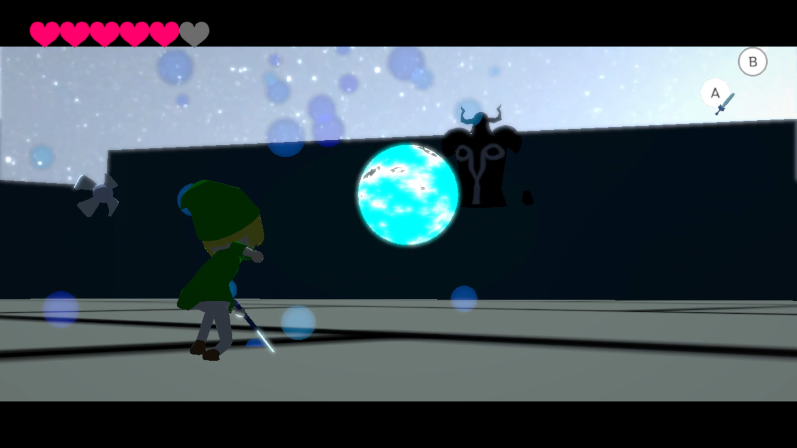

# 就職作品 : **VS ファントム**
## この作品について
この作品は、「**ゼルダの伝説 風のタクト**」に登場する中ボス、「**ファントムガノン**」との戦いを再現するために開発している作品です。[^1]

[作品プレイ映像はこちら](https://youtu.be/x2WuLgSkXnI)
[^1]: [ファントムガノン戦](https://www.youtube.com/watch?v=9eoUYuAO9wI)

## 作品で実装したもの
### Z注目(ロックオン)
コントローラーの_左トリガー_を押し込むことで**Z注目**を行います。  
注目時の角度は、ロックオン開始時に**敵がどこにいるか**で変化するようになっています。  
ロックオンできる対象が画面内にいない場合、プレイヤーの背面にカメラが回り込みます。

### 敵との弾のラリー
敵が発射した弾を、**通常攻撃で打ち返す**ことができ、複数回繰り返すと敵が**ダウン**します。  
ダウンした敵には、攻撃を行うことができます。

### コンボ作成システム
プレイヤーのコンボ攻撃をImGui上から**作成、編集、保存**ができる機能です。  
再生するアニメーションや、攻撃段数、硬直時間等を編集することが可能で、保存するとjson形式のファイルで保存が行われます。  
コンボ攻撃中、特定の変数の条件を満たした際に指定した任意の別のコンボに切り替えられる機能を実装しています。  
これには、コンボを管理する'ComboManager'に対して、**条件となる変数を追加**する必要があります。  
実際のゲーム内でコンボを変更する場合は、'ComboManager'に対して、**コンボ変更関数**を呼び出すことでコンボ攻撃の内容が変化するようになっています。
['ComboManager'に関するソースコードはこちら](https://github.com/Yuki-Toyoda/KEngine/tree/WPO_00_dev/App/GameObject/User/Player/Combo)
